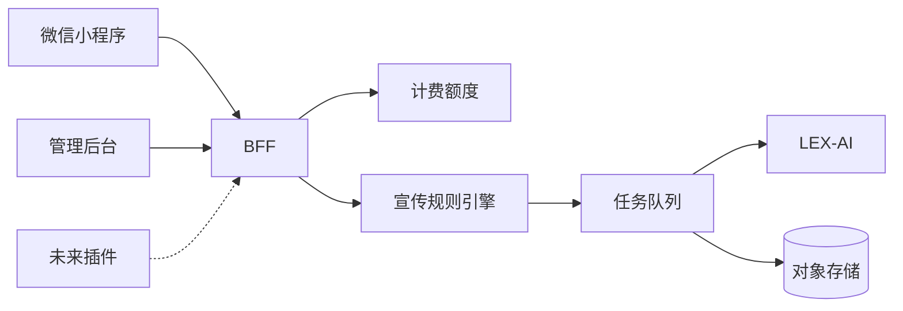
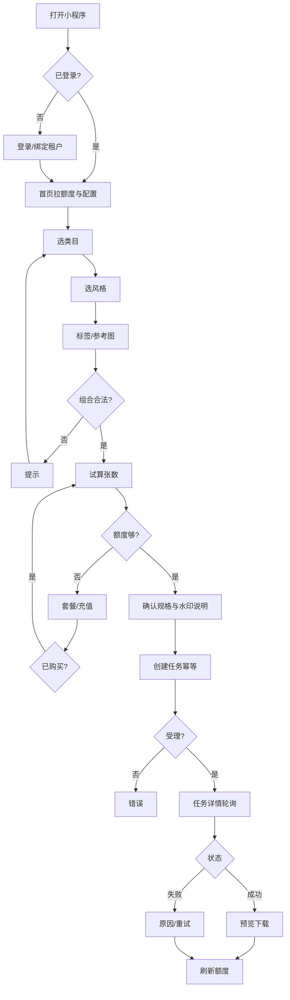
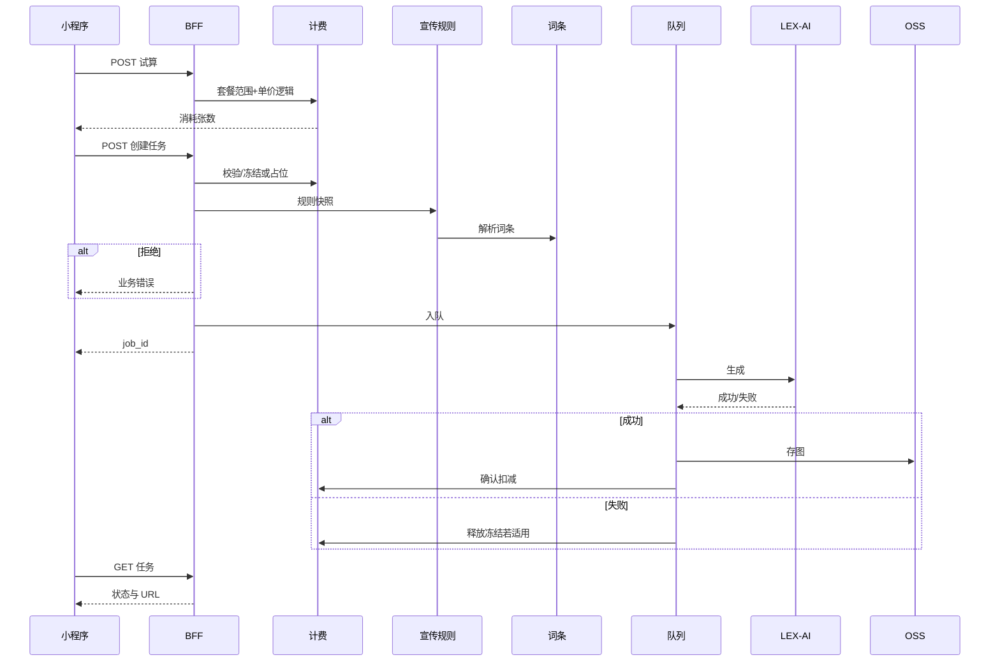

# LEX AI Studio — 商品宣传图与平台扩展：产品与技术规格

> **用途**：研发排期、接口设计、测试用例与工作量评估的**单一事实来源（草案）**。  
> **仓库**：`lex-ai-studio`（`miniprogram/`、`admin/`、`project.config.json`）。  
> **版本**：v2.0 重新生成稿  
> **日期**：2026-05-11

---

## 目录

1. [读者与用法](#1-读者与用法)  
2. [背景与目标](#2-背景与目标)  
3. [范围与非目标](#3-范围与非目标)  
4. [分期与里程碑](#4-分期与里程碑)  
5. [术语](#5-术语)  
6. [架构](#6-架构)  
7. [功能清单（含关键逻辑与界面）](#7-功能清单含关键逻辑与界面)  
8. [界面规格](#8-界面规格)  
9. [流程与状态](#9-流程与状态)  
10. [数据模型概要](#10-数据模型概要)  
11. [API 与错误码](#11-api-与错误码)  
12. [验收要点（研发自测）](#12-验收要点研发自测)  
13. [非功能需求](#13-非功能需求)  
14. [风险与待定](#14-风险与待定)  
15. [变更记录](#15-变更记录)

---

## 1. 读者与用法

| 角色 | 重点章节 |
|------|----------|
| 产品 | 2、3、4、5、7、9、14 |
| 小程序前端 | 4、7、8、9、11 |
| 后台前端 | 7、8、11 |
| 后端 / 架构 | 6、7、9、10、11、13 |
| 测试 | 3、7、9、12、13 |

**估点建议**：LEX-AI 适配、任务队列、额度流水、OSS、联调各占独立子项；P0 按「端到端一条任务成功」为最小闭环拆分。

---

## 2. 背景与目标

### 2.1 背景

前期对接 **LEX-AI**，输出**商品宣传图**。AI 侧可控文案由运营**手工录入词条**；按**商品类别、风格、可选标签**组合；经**宣传规则**组装后调用 LEX-AI。需建设**收费规则**与**宣传规则**，并为**电商平台扩展**、**小型 ERP 扩展**预留字段与 API 契约。

### 2.2 目标（可验收）

1. 小程序：类目 → 风格 →（可选）标签与参考图 → 规格 → 试算与确认 → 创建任务 → 进度 → 成图下载。  
2. 后台：类目/风格/词条/宣传规则/套餐定价维护；任务查询与失败诊断。  
3. 服务端：不暴露 LEX 密钥与完整 Prompt；任务幂等、状态机、结果落 OSS。  
4. 扩展：外部商品 ID、ERP 单据号等可落库或为空，不要求 P0 实现具体插件。

### 2.3 原则

- Prompt **仅在服务端**按规则组装。  
- 任务创建时固化 **规则版本 / 解析快照**，历史任务不受后续改规则影响。  
- **计费默认策略**在上线前评审定稿一种（见 9.3）。

---

## 3. 范围与非目标

**P0 范围内**：LEX-AI 出图主链路、词条+规则+类目+风格、额度/套餐一种策略、OSS、基础后台。  

**非目标（预留即可）**：各电商平台官方 API 深度对接；具体 ERP 品牌适配；生成后人工审核队列；分销拼团等复杂营销。

---

## 4. 分期与里程碑

| 阶段 | 内容 |
|------|------|
| **P0** | 主链路 + BFF + LEX 适配 + OSS + 额度试算/扣减一种 + 后台配置与任务列表 |
| **P1** | 规则灰度、合规增强、运营重试、对账导出、限流与可观测细化 |
| **P2** | OpenAPI、外部商品映射、Webhook、API Key |

---

## 5. 术语

| 术语 | 含义 |
|------|------|
| AI 词条 | 运营维护的片段（正向/负面/前缀/品牌约束等），带适用范围与优先级。 |
| 宣传规则 | 词条选取、槽位组装、画幅/水印/合规策略；可版本化。 |
| 收费规则 | 套餐、按张、超额价、租户协议价；与冻结/扣减策略绑定。 |
| 生成任务 Job | 单次出图请求，含状态机与 LEX 追踪信息。 |

---

## 6. 架构

**约束**：小程序与后台均**不直连** LEX-AI；密钥仅服务端。

---

## 7. 功能清单（含关键逻辑与界面）

说明列：**逻辑** = 实现要点；**界面** = 小程序/后台；**P** = P0/P1/P2。

### 7.1 租户与用户

| ID | 功能 | P | 逻辑 | 界面 |
|----|------|---|------|------|
| U1 | 租户 | P0 | `tenant_id` 数据隔离；用户归属租户 | 小程序展示企业名；后台租户列表 |
| U2 | 登录 | P0 | 微信登录或账号；首登绑定租户 | 登录页品牌感 |
| U3 | 角色权限 | P1 | RBAC；运营与租户成员分离 | 小程序隐藏配置类菜单 |
| U4 | API Key | P2 | 哈希存储；仅后台轮换 | 后台「集成」页 |

### 7.2 商品维度（入参）

| ID | 功能 | P | 逻辑 | 界面 |
|----|------|---|------|------|
| P1 | 类目树 | P0 | 稳定 `category_code`；与词条/套餐范围绑定 | 小程序：电商类目导航；后台：树编辑 |
| P2 | 风格 | P0 | 枚举+封面；关联规则版本 | 小程序：宫格卡片、选中态 |
| P3 | 标签 | P1 | 多选上限服务端配置；与类目组合校验 | 小程序：横向 chips |
| P4 | 参考图 | P0 | 预签名上传 OSS；格式大小限制 | 小程序：相册/拍照 |

### 7.3 词条库

| ID | 功能 | P | 逻辑 | 界面 |
|----|------|---|------|------|
| T1 | 词条 CRUD | P0 | 类型与权重/排序；审计 | 后台表格+抽屉 |
| T2 | 适用范围 | P0 | 与类目/风格/标签多对多；细粒度优先 | 后台范围选择器 |
| T3 | 生效时间 | P1 | 时间窗；定时切换 | 后台时间字段 |
| T4 | 冲突与兜底 | P0 | `priority`；无命中则默认集或拒绝 | 小程序友好错误文案 |

### 7.4 宣传规则

| ID | 功能 | P | 逻辑 | 界面 |
|----|------|---|------|------|
| R1 | 规则版本 | P0 | 任务写入 `rule_version` 快照 | 后台版本列表与发布 |
| R2 | Prompt 组装 | P0 | 槽位+顺序+默认负面词 | 不对 C 端暴露全文 |
| R3 | 输出约束 | P0 | 比例/分辨率/水印映射 LEX 参数 | 小程序：SKU 式规格选择 |
| R4 | 合规 | P1 | 生成前拦截；错误码区分 | Toast；与计费一致 |
| R5 | 规则模拟 | P2 | 运营侧摘要预览 | 后台模拟器 |

### 7.5 收费与额度

| ID | 功能 | P | 逻辑 | 界面 |
|----|------|---|------|------|
| B1 | 套餐 | P0 | 张数、有效期、适用类目 | 小程序：套餐卡+划线价角标 |
| B2 | 流水 | P0 | `quota_ledger` 追加-only；冲正另记 | 我的额度/后台流水 |
| B3 | 试算 | P0 | 创建前返回消耗张数 | 确认页「预计消耗」 |
| B4 | 冻结/扣减 | P0 | 默认选 A 或 B（见 9.3） | 失败页说明是否退还 |
| B5 | 协议价 | P1 | 租户覆盖默认价 | 后台租户定价 |

### 7.6 LEX-AI 与任务

| ID | 功能 | P | 逻辑 | 界面 |
|----|------|---|------|------|
| J1 | 创建任务 | P0 | `client_request_id` 幂等 | 提交 loading |
| J2 | 状态机 | P0 | queued/running/succeeded/failed/cancelled | 状态标签、进度 |
| J3 | LEX 适配 | P0 | 重试、超时、错误码映射 | — |
| J4 | 查询 | P0 | 轮询退避 | 预计时长文案 |
| J5 | 存储 | P0 | 原图+水印图；签名 URL | 结果大预览、存相册 |
| J6 | 限流 | P1 | 租户/全局 QPS | 排队提示 |

### 7.7 管理后台

| ID | 功能 | P | 逻辑 | 界面 |
|----|------|---|------|------|
| A1 | 配置中心 | P0 | 类目/风格/词条/规则 CRUD | 表格+抽屉 |
| A2 | 任务监控 | P0 | 筛选、LEX trace、失败原因 | 详情侧栏 |
| A3 | 定价 | P0 | 套餐 CRUD | 表单 |
| A4 | 运营重试 | P1 | 新 job；计费策略明确 | 二次确认 |

### 7.8 小程序 C 端

| ID | 功能 | P | 逻辑 | 界面 |
|----|------|---|------|------|
| C1 | 首页 | P0 | Banner、入口、额度摘要 | 电商风轮播与卡片 |
| C2 | 生成向导 | P0 | 步骤可回退；状态保持 | 类下单路径 |
| C3 | 任务列表 | P0 | 下拉刷新；防重复提交 | 左图右文列表 |
| C4 | 套餐购买 | P1 | 接支付或留资 | 促销角标 |
| C5 | 协议隐私 | P0 | 首次生成前勾选 | 勾选区 |

### 7.9 电商 / ERP 预留

| ID | 功能 | P | 逻辑 | 界面 |
|----|------|---|------|------|
| E1 | 外部商品映射 | P2 | channel + external_product_id (+ sku) | 后台集成表 |
| E2 | 业务单据 | P2 | biz_doc_type + biz_doc_no 写入 Job | OpenAPI 文档 |
| E3 | OpenAPI | P2 | 鉴权+限流 | 开发者文档 |

---

## 8. 界面规格

### 8.1 小程序（电商平台风格）

- **色**：主色 `#1e6bff`；强调价/促销 `#ff4d4f`；浅灰底、白卡片、轻阴影、圆角约 24rpx。  
- **IA**：首页 → 向导（类目→风格→标签/参考图→规格）→ 确认 → 任务详情 → 结果 → 我的作品。  
- **TabBar**：首页 / 生成（或中置突出）/ 我的。  
- **组件**：Banner；宫格 SKU；满宽主按钮；套餐划线价+角标；任务状态标签。  
- **交互**：生成中禁用重复提交；下拉刷新；弱网重试提示。

### 8.2 管理后台

桌面表格 + 抽屉；危险操作确认；与小程序**同源配置 API**。

---

## 9. 流程与状态

### 9.1 用户主流程

### 9.2 服务端序列

### 9.3 计费默认策略（评审二选一）

| 方案 | 提交时 | 成功 | 失败 |
|------|--------|------|------|
| **A 冻结** | 冻结 N 张 | 解冻并扣 N | 解冻退还 |
| **B 成功扣** | 不冻结 | 扣 N | 不扣 |

实现与前后端文案必须与选定方案一致。

### 9.4 任务状态机

`queued` → `running` → `succeeded` | `failed`；可选 `cancelled`。超时进入 `failed` 并记 `error_code`。

### 9.5 运营发版（不影响历史任务）

新版本仅作用于**新创建任务**；已创建任务仅用创建时快照。

---

## 10. 数据模型概要

建议实体：`tenant`、`user`、`role`、`product_category`、`style`、`tag`、`ai_term`、`ai_term_scope`、`promo_rule`、`promo_rule_version`、`pricing_plan`、`tenant_pricing_override`、`quota_account`、`quota_ledger`、`generation_job`、`generation_job_event`、`asset`、`external_product_mapping`（P2）、`integration_credential`（P2）。

**Job 索引建议**：`tenant_id`、`status`、`created_at`、`client_request_id`（唯一）。

---

## 11. API 与错误码

### 11.1 REST 草案

| 方法 | 路径 | 说明 |
|------|------|------|
| GET | `/api/v1/categories` | 类目树 |
| GET | `/api/v1/styles` | 风格 |
| GET | `/api/v1/tags` | 标签可选 |
| POST | `/api/v1/uploads/presign` | 上传凭证 |
| POST | `/api/v1/quota/preview` | 试算 |
| POST | `/api/v1/jobs/image` | 创建任务 |
| GET | `/api/v1/jobs/{id}` | 查询任务 |
| GET | `/api/v1/quota` | 额度摘要 |

### 11.2 错误码（示例）

`INSUFFICIENT_QUOTA`、`INVALID_COMBO`、`COMPLIANCE_REJECT`、`LEX_TIMEOUT`、`LEX_VENDOR_ERROR`、`IDEMPOTENT_REPLAY`（返回同一 `job_id`）。

---

## 12. 验收要点（研发自测）

- 同 `client_request_id` 重复提交仅一条扣费/一 job。  
- 改规则后旧 job 结果与计费不受影响。  
- 额度为 0 时创建任务被拒绝且错误码正确。  
- LEX 失败时额度行为符合 9.3 选定方案。  
- 水印图与高清图 URL 权限符合小程序下载域名配置。

---

## 13. 非功能需求

安全（密钥、脱敏）、性能（分页、轮询退避）、可观测（成功率、P95、LEX 错误码）、合规（协议、数据保留策略）。

---

## 14. 风险与待定

LEX-AI 同步/异步形态与限额；是否接微信支付；水印与版权条款；类目与规则规模下的性能与缓存策略。

---

## 15. 变更记录

| 版本 | 日期 | 说明 |
|------|------|------|
| v2.0 | 2026-05-11 | 重新生成：目录、验收要点、表格精简 |
| v1.0 | — | 初版整合（若存在历史稿可合并说明） |

---

**路径**：`docs/商品宣传图-产品与技术规格.md`
